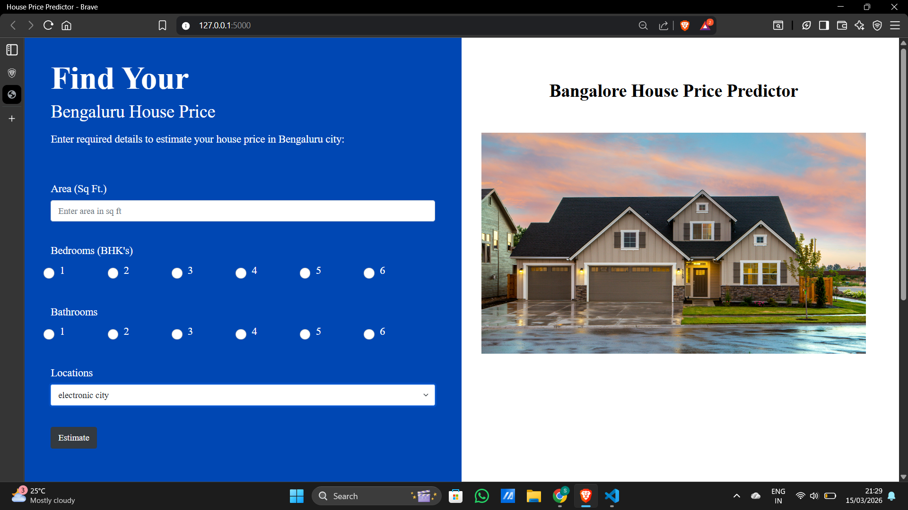

# 🏙️ Bangalore House Price Prediction using Machine Learning

## 📌 Project Overview

This project predicts house prices in Bangalore using machine learning techniques based on key features such as location, total square feet, number of bedrooms (BHK), and bathrooms.

Developed in **2023 as an academic group project**, it demonstrates an end-to-end ML workflow — from data preprocessing and feature engineering to model training and deployment using a Flask web application.

---

## 🕒 Project Context

This project is preserved in its original working state to showcase my early hands-on experience with:

* Data preprocessing
* Feature engineering
* Regression-based model building
* Model deployment using Flask

---

## 🚀 Features

* Real-time house price prediction based on user inputs
* End-to-end machine learning pipeline
* Advanced preprocessing and outlier handling
* Model comparison (Linear, Lasso, Ridge)
* Flask-based web interface for predictions

---

## 🧠 Machine Learning Workflow

```text
Data Collection → Data Cleaning → Feature Engineering → Outlier Removal → Encoding & Scaling →
Model Training → Model Evaluation → Model Selection (Ridge) → Model Saving → Flask Integration → Prediction Output
```

---

## 📊 Dataset & Features

The dataset includes the following key attributes:

* Location
* Total Square Feet
* Number of Bedrooms (BHK)
* Number of Bathrooms
* Price

---

## 🔧 Feature Engineering

* Extracted BHK from the `size` column
* Converted range values (e.g., 1000–1200 sqft) into numeric format
* Created a new feature: **price per sqft**
* Grouped low-frequency locations into an `"other"` category

---

## ⚙️ Data Preprocessing

- Handled missing values using domain-specific logic  
- Removed irrelevant columns  
- Applied One-Hot Encoding for categorical variables  
- Standardized numerical features  
- Performed outlier removal based on:
  - Square feet per BHK
  - Price per square foot
  - Location-based filtering

---

## 🤖 Algorithms Used

| Algorithm         | Description            | Purpose               |
| ----------------- | ---------------------- | --------------------- |
| Linear Regression | Basic regression model | Baseline              |
| Lasso Regression  | L1 Regularization      | Feature selection     |
| Ridge Regression  | L2 Regularization      | Final model selection |

---

## 📈 Model Performance

| Model             | R² Score |
| ----------------- | -------- |
| Linear Regression | 0.8234   |
| Lasso Regression  | 0.8128   |
| Ridge Regression  | 0.8234   |

---

## 📌 Model Selection Insight

Although Linear Regression achieved similar performance, **Ridge Regression** was selected because:

* Reduces overfitting
* Handles multicollinearity effectively
* Produces more stable predictions for deployment

---

## ⚙️ ML Pipeline

The final pipeline consists of:

* One-Hot Encoding (Location)
* Standard Scaling
* Ridge Regression

---

## 🖥️ Web Application

The trained model is deployed using a Flask application (`server.py`).

### Workflow

1. User enters property details
2. Inputs are preprocessed
3. Model predicts the house price
4. Result is displayed on the UI

---

## ▶️ Running the Application

```bash
cd Server
python server.py
```

Then open in your browser:

```
http://127.0.0.1:5000/
```

---

## 📸 Output Screenshots

### Input Page


### Predicted Price Output


---

## 💡 Key Highlights

* End-to-end ML project with deployment
* Strong focus on preprocessing and feature engineering
* Use of regularization techniques
* Pipeline-based implementation
* Real-world dataset application

---

## ⚠️ Limitations

* No real-time data integration
* Limited feature set
* Model performance depends on dataset quality

---

## 🔮 Future Improvements

* Implement advanced models (XGBoost, Neural Networks)
* Enhance feature engineering
* Integrate real-time data sources
* Deploy on cloud platforms (AWS / GCP / Azure)

---

## 🏁 Final Note

This project reflects my foundational understanding of machine learning workflows, including preprocessing, model selection, and deployment using Flask.
